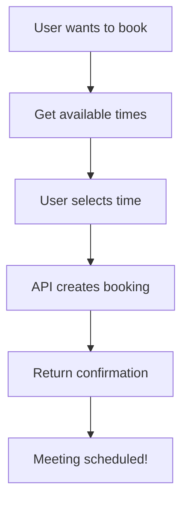

# Calendly OAuth Implementation - Direct Booking Capability

## 🔐 OAuth Credentials Received

- **Client ID**: `mxNQwn2b0Jk-_1Ndq4iol_zwuamdnkaIRc8tY09-a10`
- **Client Secret**: `••••••••••••••••••••••••••••••••••••••••`
- **Webhook Signing Key**: `••••••••••••••••••••••••••••••••••••••••`

## 🚀 New Capabilities with OAuth

### Direct Scheduling Features We Can Implement:

1. **One-Time Scheduling Links**
   - Create temporary booking links for specific time slots
   - Auto-expire after use
   - No need to redirect to Calendly website

2. **Direct API Booking**
   - Book meetings directly through the API
   - Specify exact date/time
   - Add invitee details programmatically

3. **Available Times API**
   - Get real-time availability
   - Filter by date range
   - Return specific time slots

4. **Instant Booking**
   - Book a meeting immediately
   - Skip the Calendly UI entirely
   - Return confirmation directly

## 📝 Implementation Steps

### Step 1: OAuth Flow Setup
```javascript
// OAuth configuration
const OAUTH_CONFIG = {
  client_id: 'mxNQwn2b0Jk-_1Ndq4iol_zwuamdnkaIRc8tY09-a10',
  client_secret: process.env.CALENDLY_CLIENT_SECRET,
  redirect_uri: process.env.CALENDLY_REDIRECT_URI || 'http://localhost:3000/auth/callback',
  authorization_url: 'https://auth.calendly.com/oauth/authorize',
  token_url: 'https://auth.calendly.com/oauth/token'
};
```

### Step 2: New Tools to Implement

1. **calendly_get_available_times**
   - Input: event_type, date_range, timezone
   - Output: Array of available time slots

2. **calendly_book_meeting_direct**
   - Input: event_type, datetime, invitee_name, invitee_email, timezone
   - Output: Booking confirmation with meeting details

3. **calendly_create_instant_meeting**
   - Input: duration, start_time, invitee_info
   - Output: Meeting created with calendar invites sent

4. **calendly_oauth_authenticate**
   - Handles OAuth flow
   - Stores access tokens
   - Auto-refresh tokens

### Step 3: Direct Booking Flow



## 🔧 New Endpoints to Add

### `/api/available-times`
```javascript
POST /api/available-times
{
  "event_type_uuid": "xxx",
  "start_date": "2024-01-15",
  "end_date": "2024-01-20",
  "timezone": "America/New_York"
}
```

### `/api/book-direct`
```javascript
POST /api/book-direct
{
  "event_type_uuid": "xxx",
  "start_time": "2024-01-15T14:00:00Z",
  "invitee": {
    "name": "Antonio",
    "email": "markserga@icloud.com"
  },
  "timezone": "America/New_York",
  "questions": [
    {
      "answer": "I need help with integration",
      "position": 0
    }
  ]
}
```

## 🎯 Benefits for Antonio's Use Case

1. **No More Timezone Issues**: We handle timezone conversion server-side
2. **Direct Booking**: No need to leave n8n or your app
3. **Instant Confirmation**: Get meeting details immediately
4. **Pre-filled Data**: All information handled programmatically
5. **Custom Workflows**: Integrate with other n8n nodes seamlessly

## 📋 Required Environment Variables

```env
# OAuth Credentials
CALENDLY_CLIENT_ID=mxNQwn2b0Jk-_1Ndq4iol_zwuamdnkaIRc8tY09-a10
CALENDLY_CLIENT_SECRET=your_client_secret_here
CALENDLY_WEBHOOK_SIGNING_KEY=your_webhook_key_here
CALENDLY_REDIRECT_URI=https://your-domain.com/auth/callback

# OAuth Tokens (stored after authentication)
CALENDLY_ACCESS_TOKEN=will_be_set_after_oauth
CALENDLY_REFRESH_TOKEN=will_be_set_after_oauth
```

## 🚀 Next Steps

1. Implement OAuth authentication flow
2. Add token storage and refresh mechanism
3. Create new direct booking endpoints
4. Add the new tools to MCP server
5. Test with Antonio's "30 Minute Meeting" scenario
6. Deploy updated version

## ⚡ Quick Start for Testing

Once implemented, Antonio will be able to:

```javascript
// In n8n, simply call:
{
  "tool": "calendly_book_meeting_direct",
  "params": {
    "meeting_type": "30 Minute Meeting",
    "datetime": "2024-01-15 2:00 PM",
    "name": "Antonio",
    "email": "markserga@icloud.com",
    "timezone": "America/New_York"
  }
}

// Response:
{
  "success": true,
  "booking": {
    "confirmation_number": "CAL-XXXX",
    "meeting_url": "https://zoom.us/...",
    "calendar_event": {
      "title": "30 Minute Meeting with Antonio",
      "start": "2024-01-15T14:00:00-05:00",
      "end": "2024-01-15T14:30:00-05:00"
    }
  }
}
```

No more redirects, no more timezone confusion - just direct booking!